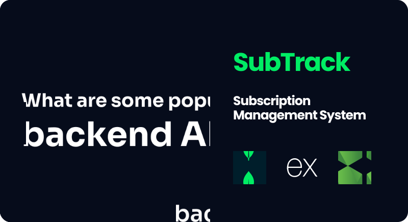

<p align="center">
  
</p>

##

<p align="center">
  
  
  
</p>

<h1 align="center">SubTrack</h1>

<p align="center">
  A <b>backend API</b> for managing subscriptions with <b> users</b>, <b>money</b>, and <b> business logic</b>.  
  Includes JWT authentication, database modeling, security mechanisms, automated workflows, and email notifications.
</p>

---

## ✨ Features

- 🔐 **JWT Authentication** – Secure login, user CRUD, and subscription management
- 🗄 **Database Modeling** – MongoDB with Mongoose for models & relationships
- 🛡 **Rate Limiting & Bot Protection** – Arcjet integration to secure the app
- ⚡ **Global Error Handling** – Centralized error handling and validation middleware
- 📜 **Logging Mechanisms** – Debugging and monitoring support
- 📧 **Email Reminders** – Automated workflows via **Upstash QStash** + Nodemailer
- 🧩 **Scalable Architecture** – Code structured for reusability and maintainability

---

## ⚡ Quick Start

Follow these steps to run the project locally.

### 1️⃣ Clone the repository
```bash
git clone https://github.com/Renz-Eryll/SubTrack.git
```

### 2️⃣ Install dependencies
```bash
npm install
```

### 3️⃣ Configure environment variables  
Create a `.env` file in the root directory and add:

```env
# PORT
PORT=5500
SERVER_URL="http://localhost:5500"

# ENVIRONMENT
NODE_ENV=development

# DATABASE
DB_URI=

# JWT AUTH
JWT_SECRET=
JWT_EXPIRES_IN="1d"

# ARCJET
ARCJET_KEY=
ARCJET_ENV="development"

# UPSTASH
QSTASH_URL=http://127.0.0.1:8080
QSTASH_TOKEN=

# NODEMAILER
EMAIL_PASSWORD=
```

### 4️⃣ Start the server
```bash
npm run dev
```

Server runs at: **http://localhost:5500**

---

## 📧 Contact

- **Name**: Renz Eryll Ramelo  
- **LinkedIn**: [linkedin.com/in/renz-eryll-ramelo](https://www.linkedin.com/in/renz-eryll-ramelo)  
- **GitHub**: [github.com/Renz-Eryll](https://github.com/Renz-Eryll)  
